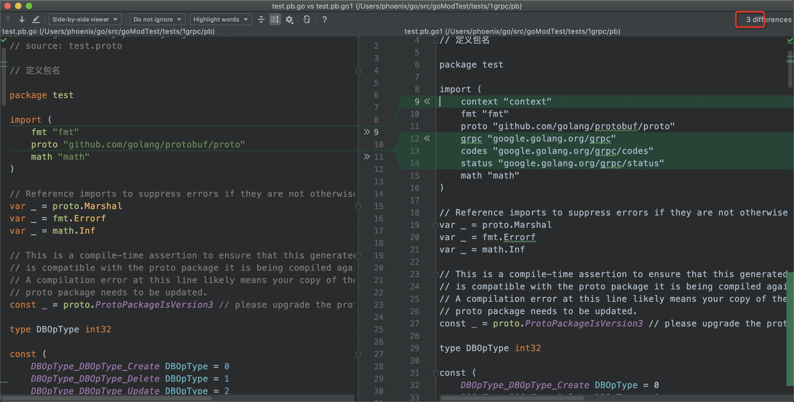
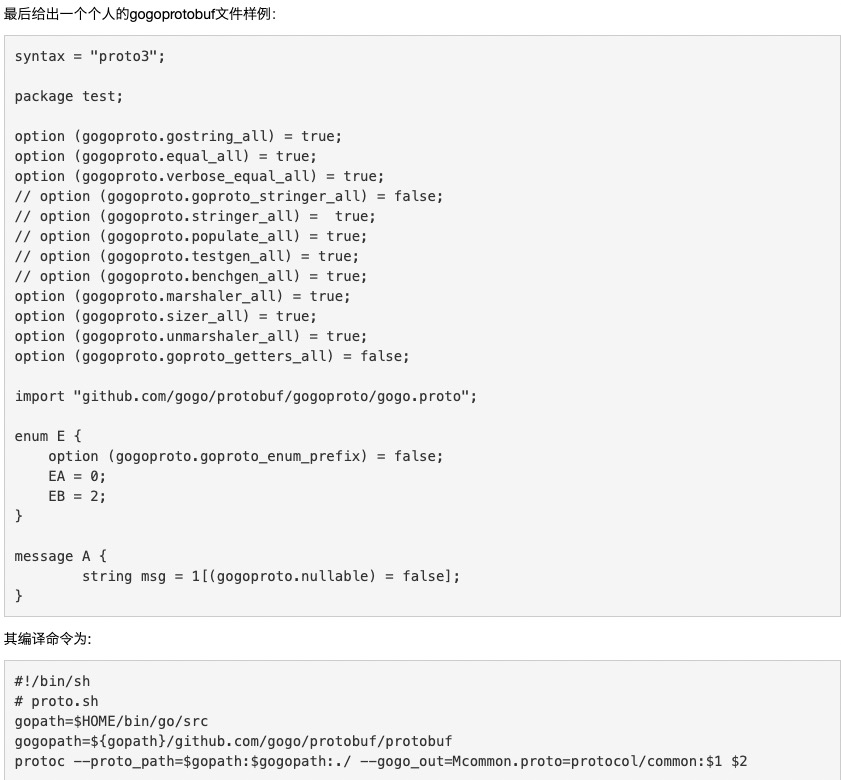

# 说明

[官方文档](https://github.com/golang/protobuf)

## go 中使用 protocol buffer

```
protoc --go_out=. *.proto
```


## gPPC支持

```
protoc --go_out=plugins=grpc:. *.proto
```

* 指定文件

  `protoc --go_out=plugins=grpc:./ ./test.proto`

* 生成内容对比




## [枚举类型生成多Type前缀](https://github.com/golang/protobuf/issues/513)

## 解决方式

[gogoExtension](https://github.com/gogo/protobuf/blob/master/extensions.md#goprotobuf-compatibility)


## gogo 使用

```
protoc --gofast_out=. myproto.proto
```

## gogo GRPC

```
protoc --gofast_out=plugins=grpc:. my.proto
```

## 完整示例



